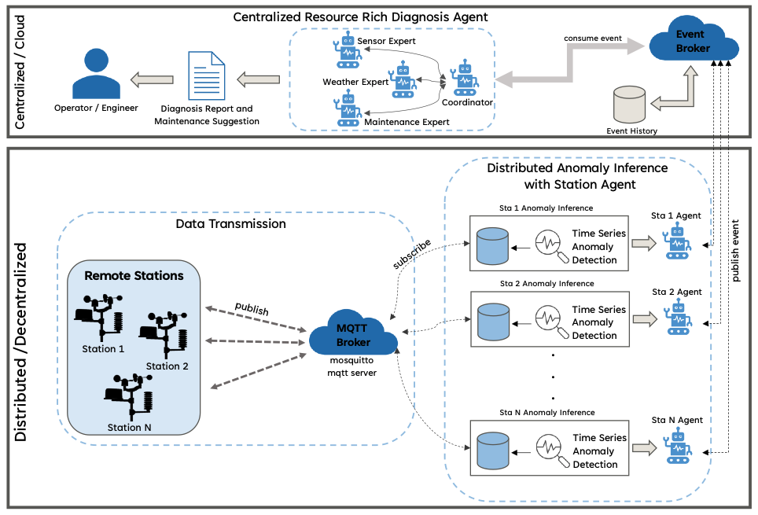
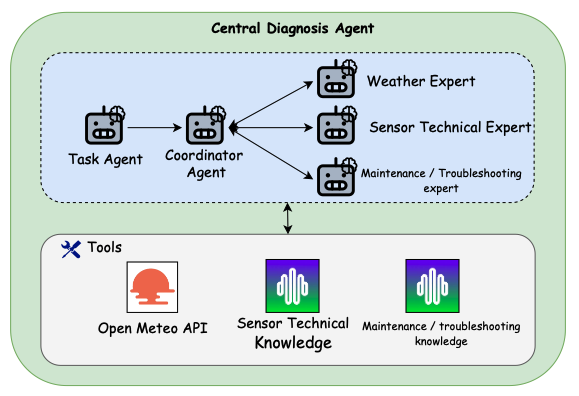
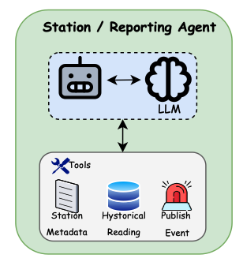

# Weather Anomaly Detection Multi-Agent System

A distributed multi-agent system for real-time weather station monitoring, anomaly detection, and intelligent diagnostics using CAMEL AI framework and Anomaly Transformer models.

[](https://www.python.org/)
[](LICENSE)
[](https://github.com/camel-ai/camel)

---

## 🌟 Overview

This system implements an intelligent weather monitoring infrastructure with:

- **Distributed Anomaly Detection**: 10 independent weather stations with local AI agents
- **Deep Learning Models**: Anomaly Transformer for time-series anomaly detection
- **Multi-Agent Architecture**: Station-level and central diagnostic agents using CAMEL AI
- **Knowledge-Based Diagnosis**: RAG system powered by Cognee for maintenance recommendations
- **Real-Time Processing**: MQTT-based event streaming and Kafka integration

### Research Contributions

- Novel application of Anomaly Transformer for meteorological sensor health monitoring
- Multi-agent architecture for distributed anomaly diagnosis
- Integration of statistical analysis and LLM-based reasoning for sensor fault detection
- Knowledge-augmented maintenance recommendation system

---

## 🏗️ System Architecture
### Overall Architecture


### Central Diagnosis Agent


### Station Agent


### Key Components

1. **Station-Level Detection** (`anomaly_detection/`)
   - Anomaly Transformer deep learning models
   - Sliding window data processing
   - Local CAMEL AI agents for preliminary analysis
   - Kafka event publishing

2. **Central Diagnosis** (`cognee/`)
   - Multi-station anomaly aggregation
   - RAG-based diagnostic reasoning
   - Maintenance knowledge retrieval
   - Interactive knowledge management

3. **Data Transmission**
   - MQTT protocol simulation (replaces AWS remote data transmission)
   - 10-minute intervals
   - Real-time event streaming

---

## 📁 Repository Structure
```
weather-anomaly-detection/
│
├── README.md                          # This file
├── LICENSE
├── .gitignore
├── requirements.txt                   # Consolidated dependencies (optional)
│
├── anomaly_detection/ # Station-Level Components
│   ├── README.md                      # Station setup guide
│   ├── station_001/
│   │   ├── README.md                  # Station-specific instructions
│   │   ├── checkpoints/               # Trained models
│   │   ├── data/                      # Station database
│   │   ├── dataset/                   # Test data
│   │   ├── logs/                      # Outputs
│   │   ├── src/                       # Source code
│   │   ├── main.py
│   │   └── requirements.txt
│   ├── station_002/
│   └── ... (up to station_010)
|   └── Analyze Anomaly (Threshold calculation)
│
├── cognee/                            # Central Diagnosis Agent
│   ├── README.md                      # Diagnosis agent guide
│   ├── agent/
│   │   ├── central_agent.py
│   │   ├── prompt_template.py
│   │   ├── tools.py
│   │   └── document/                  # Knowledge base
│   ├── interactive_workforce.py
│   ├── requirements.txt
│   └── .env.example
│
└── docs/                              # Additional documentation
    ├── INSTALLATION.md
    ├── DEPLOYMENT.md
    ├── API_REFERENCE.md
    └── EVALUATION.md
```

---

## 🚀 Quick Start

### Prerequisites

- Python 3.8+
- MQTT broker (Mosquitto or use public broker)
- OpenAI API key or compatible LLM endpoint

### Installation

1. **Clone Repository**
```bash
   git clone https://github.cs.adelaide.edu.au/a1932040/remote_file.git
```

2. **Setup Station Agent** (Example: Station DIY Stageof Yogyakarta)
```bash
   cd anomaly_detection/anomaly_monitor_diy_stageof_yogyakarta
   python -m venv venv
   source venv/bin/activate  # Linux/Mac
   pip install -r requirements.txt
   
   # Configure
   nano src/config.py  # Set MQTT broker, thresholds, etc.
   
   # Run
   python main.py
```

3. **Setup Central Diagnosis Agent** (New Terminal)
```bash
   cd cognee
   python -m venv venv
   source venv/bin/activate
   pip install -r requirements.txt
   
   # Configure
   cp .env.example .env
   nano .env  # Add LLM_API_KEY
   
   # Run
   python agent/central_agent.py
```


For detailed setup instructions:
- **Station Setup**: See [`anomaly_detection/README.md`](anomaly_detection/README.md)
- **Diagnosis Agent**: See [`cognee/README.md`](cognee/README.md)

---

## 🔧 Configuration

### Station Configuration

Each station has independent configuration in `src/config.py`:
```python
STATION_ID = "station_001"
MQTT_BROKER = "your mqtt broker"
ANOMALY_THRESHOLD = 0.7
WINDOW_SIZE = 100
```

### Central Agent Configuration

Environment variables in `cognee/.env`:
```bash
LLM_API_KEY=your-api-key
ENABLE_BACKEND_ACCESS_CONTROL=true
REQUIRE_AUTHENTICATION=true
```

---

## 📊 Features

### Station-Level Features
- ✅ Real-time anomaly detection using Anomaly Transformer
- ✅ Sliding window processing (configurable)
- ✅ Local AI agent with reasoning chains
- ✅ Kafka event publishing
- ✅ Comprehensive logging (scores + thought processes)
- ✅ Synthetic anomaly testing

### Central Agent Features
- ✅ Multi-station anomaly aggregation
- ✅ RAG-based diagnostic reasoning
- ✅ Maintenance knowledge retrieval
- ✅ Interactive knowledge base management
- ✅ Sensor-specific maintenance protocols

---

## 🧪 Testing & Evaluation

### Station Performance Testing
Example:
```bash
cd anomaly_detection/station_diy_stageof_yogyakarta/src
python evaluate.py \
  --dataset /home/ubuntu/running/anomaly_detection/anomaly_monitor_diy_stageof_yogyakarta/dataset/dataset.csv \
  --test-data /home/ubuntu/running/anomaly_detection/anomaly_monitor_diy_stageof_yogyakarta/dataset/synthetic_data_with_anomalies.csv \
  --checkpoint /home/ubuntu/running/anomaly_detection/anomaly_monitor_diy_stageof_yogyakarta/checkpoints/all_checkpoint.pth \
  --threshold 0.3548 \
  --apply-adjustment \
  --apply-lag \
  --lag-tolerance 20
```

### End-to-End System Test

1. Start MQTT broker: `your mqtt broker`
2. Launch stations: `python main.py` (in each station folder)
3. Start central agent: `python agent/central_agent.py`
4. Inject test anomalies
5. Monitor outputs in `logs/` directories

---

## 📈 Results

### Statistical Analysis

- **Faithfulness**: ANOVA revealed GPT-OSS 120B and GPT-4.1 Mini performed comparably (p = 0.417)
- **Relevance**: Kruskal-Wallis showed GPT-4.1 Mini significantly outperformed both GPT-OSS models (p < 0.001)

### Expert Evaluation

- **Diagnostic Accuracy**: Mean score 4.2/5.0
- **Maintenance Quality**: Mean score 4.1/5.0
- **Inter-rater Agreement**: 7/8 cases showed consistent high ratings

---

## 🚀 Deployment

### Single Station Deployment

Each station folder is self-contained and can be deployed independently:
```bash
# Copy station folder to target machine
scp -r station_001/ user@remote:/path/to/deployment/

# SSH to target
ssh user@remote

# Setup and run
cd /path/to/deployment/station_001
python -m venv venv
source venv/bin/activate
pip install -r requirements.txt
python main.py
```

### Multi-Station Deployment

See [`docs/DEPLOYMENT.md`](docs/DEPLOYMENT.md) for production deployment guide.

---

## 📚 Documentation

- **Installation Guide**: [`docs/INSTALLATION.md`](docs/INSTALLATION.md)
- **Deployment Guide**: [`docs/DEPLOYMENT.md`](docs/DEPLOYMENT.md)
- **API Reference**: [`docs/API_REFERENCE.md`](docs/API_REFERENCE.md)
- **Evaluation Methodology**: [`docs/EVALUATION.md`](docs/EVALUATION.md)

---

## 🤝 Contributing

Contributions are welcome! Please:

1. Fork the repository
2. Create a feature branch (`git checkout -b feature/amazing-feature`)
3. Commit changes (`git commit -m 'Add amazing feature'`)
4. Push to branch (`git push origin feature/amazing-feature`)
5. Open a Pull Request

---

## 📄 License

This project is licensed under the MIT License - see the [LICENSE](LICENSE) file for details.

---

## 📧 Contact
**Email**: a1932040@adelaide.edu.au
**Institution**: University of Adelaide  
---

## 🙏 Acknowledgments
- Centre for Research on Engineering Software Technologies - [https://crest-centre.net](https://crest-centre.net)
- BMKG (Indonesia's Meteorological Agency) - [https://awscenter.bmkg.go.id]
- CAMEL AI Framework - [https://github.com/camel-ai/camel](https://github.com/camel-ai/camel)
- Cognee Knowledge Base - [https://github.com/topoteretes/cognee](https://github.com/topoteretes/cognee)
- Anomaly Transformer - [https://arxiv.org/abs/2110.02642]

---
